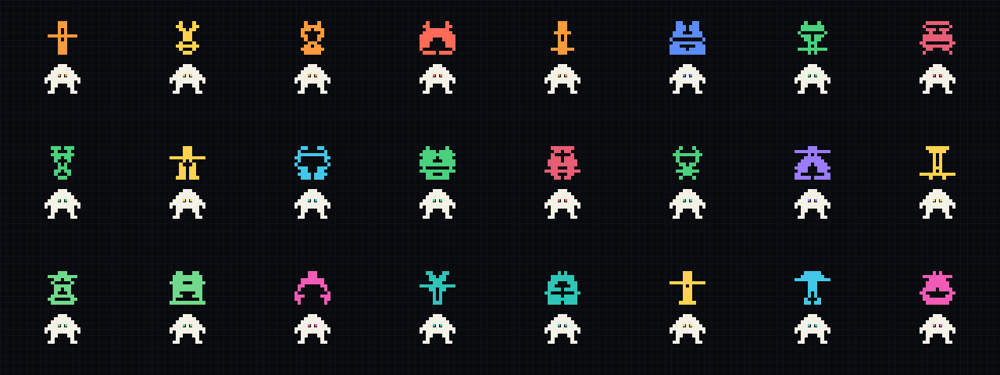

# Bitling

[](https://github.com/kotuke/bitling/actions/workflows/test.yml)
[](LICENSE)

Deterministic pixel avatars in a bot-crew style: a black field edge to edge, a
quiet square grid, one white robot shared by everyone and a personal colored
pixel sigil above it.



**[Live gallery →](https://kotuke.github.io/bitling/)** — 100 generated avatars.

Generation is entirely local and deterministic. No neural network, no network
calls, no database, no runtime dependencies. The same `userId` with the same
`AVATAR_SECRET` always yields the same avatar.

## Features

- SVG and real PNG straight from Node.js;
- sizes from `32×32` to `2048×2048`;
- bilaterally symmetric, connected pixel sigils;
- HMAC-SHA-256 instead of putting the raw `userId` into the image;
- versioned HTTP endpoint;
- `ETag`, `Cache-Control: immutable`, CORS and an in-memory LRU cache;
- CLI and TypeScript declarations;
- zero runtime dependencies.

## Quick start

Node.js 20 or newer is required.

```bash
AVATAR_SECRET='replace-with-a-long-random-secret' npm start
```

```text
GET http://127.0.0.1:3000/avatars/v1/user-123.svg
GET http://127.0.0.1:3000/avatars/v1/user-123.png
GET http://127.0.0.1:3000/avatars/v1/user-123.png?size=512
GET http://127.0.0.1:3000/health
```

Valid sizes are `32…2048`, the default is `256`. For identifiers containing
spaces or special characters use ordinary URL encoding:

```js
const url = `/avatars/v1/${encodeURIComponent(user.id)}.svg`;
```

## Why a secret

The avatar is a function of `userId`. Without a secret that function is fully
predictable: anyone who knows the algorithm can render an avatar for a guessed
identifier and compare it with what your site serves, which turns the avatar into
an oracle for "does this email have an account here?". Keying the hash with
`AVATAR_SECRET` keeps the image deterministic for you and unreproducible for
everyone else, and lets you rotate the whole avatar set at once if you ever need
to. Keep the secret on the backend: never ship it to the client, never put it in
a URL.

## Use as a module

```js
import {
  generateAvatarPng,
  generateAvatarSvg,
} from "./src/avatar.mjs";

const options = {
  secret: process.env.AVATAR_SECRET,
  size: 256,
};

const svg = generateAvatarSvg("user-123", options);
const png = generateAvatarPng("user-123", options);
```

When both formats are needed, compute the seed once:

```js
import {
  createAvatarDescriptor,
  renderAvatarPng,
  renderAvatarSvg,
} from "./src/avatar.mjs";

const avatar = createAvatarDescriptor("user-123", {
  secret: process.env.AVATAR_SECRET,
});

const svg = renderAvatarSvg(avatar, { size: 256 });
const png = renderAvatarPng(avatar, { size: 256 });
```

## CLI

```bash
AVATAR_SECRET='replace-with-a-long-random-secret' \
  node src/cli.mjs --id user-123 --out avatar.svg --size 256

AVATAR_SECRET='replace-with-a-long-random-secret' \
  node src/cli.mjs --id user-123 --out avatar.png --format png --size 512
```

## Checks and examples

```bash
npm test
npm run benchmark
npm run collision
npm run sample
npm run preview
npm run docs
```

`npm run sample` writes 12 sample users into `examples/generated/`, `npm run preview`
rebuilds `preview.png`, and `npm run docs` rebuilds the GitHub Pages gallery in `docs/`.

On the machine this package was built on, the `256×256` benchmark showed roughly
`0.09 ms/avatar` for SVG and `0.6 ms/avatar` for PNG. Real throughput depends on
the CPU; HTTP and CDN caching usually remove repeat generation entirely.

## Stability contract

An avatar is defined by a triple:

```text
AVATAR_VERSION + AVATAR_SECRET + userId
```

Do not change `AVATAR_SECRET` if existing avatars must stay the same. When the
algorithm changes or the secret is rotated, bump `AVATAR_VERSION` and serve a new
URL such as `/avatars/v2/...` — that also invalidates long-lived CDN caches
correctly.

Prefer an existing public UUID or a separate opaque `avatarKey` in the URL rather
than an email address or a phone number.

## What exactly is generated

The robot, the grid and the underlying math are shared across the whole set. The
personal sigil is derived from the HMAC seed and is guaranteed to:

- consist of square modules only;
- have symmetric bounds around the center;
- form a single connected shape;
- never overlap the robot;
- contain no circle, cutout or online indicator.

Sigils are abstract by design. Meaningful role pictograms are better kept fixed
rather than generated.

A visual collision is theoretically possible, as with any finite identicon. The
regression suite allows no repeats across a fixed cohort of 10,000 users; the
extended `npm run collision` check over 100,000 users reported 11 repeats at
build time. If your product needs strict uniqueness, store `accent + pixels` at
registration and, on a clash, append a stable `avatarVariant` to the input
identifier, for example `${user.id}:${user.avatarVariant}`.

## Follow-up

[bitizen](https://github.com/kotuke/bitizen) continues this project: the sigil is
gone and the figure itself became personal, in two styles — `plain` and `rich`.

## Contributing

Pull requests are welcome. Before sending one:

```bash
npm ci
npm run lint
npm test
```

Formatting follows `.editorconfig` (two spaces, LF, UTF-8), and the code style
is whatever the surrounding file already does. If a change affects the generated
figures, say so explicitly in the PR — avatars are a stability contract, and the
same `userId` is expected to keep its picture.

## License

MIT — see [LICENSE](LICENSE).
